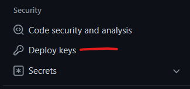

# Setup Deploy Keys

# CircleCI Setup

SSH keys are needed to give CircleCI jobs the ability to read/write to the repo
for the follow features.

* push to the repo
* make and merge pull request
* publish a release

## Generate An SSH Key for Circle CI

You will generate an SSH key/pair and store the public key in the repository
settings on GitHub under the **Deploy Key** section. Then store the private key
in Circle CI on the repositories **project settings** as an additional SSH key.
This will give Circle CI **write** access to the repository.

NOTE: GitHub will NOT let you use the same key for multiple repositories.
These key is per-repository, a requirement of GitHub. So you'll
have to do this for each repo where you want to use Version Release features.

NOTE: It is assumed you know how to follow prompts on a CLI to produce the
private and public files for an SSH key.

1. Generate an SSH key by running this in a terminal:
   ```
   ssh-keygen -t ed25519 -C "replace-with-your-email@address.here"
   ```
2. Login to GitHub and go to the repositories settings, then go to "Deploy Keys"

   

3. Click "add key" and Copy the *.pub content and paste it in
   1. Give it any name you like, (ex: CircleCI Write)
   2. and check the "Write" box
   3. then save.
4. Login to CircleCI then go to the repositories project settings.
   1. Go to "SSH Keys"
   2. Click the "Add Key" button,
   3. Give it the name "github.com" (it is important to be named after the host
      it's used for)
      NOTE: If you have GitHub Enterprise installation, then use that domain
            instead of "github.com".
   4. Paste in the private key, then save.
   5. Copy the fingerprint, you will paste this in your Circle CI config (in
      the near future).
5. Copy the Fingerprint and paste it in your CI config (the future is) now

## Setup A Personal Access Token on GitHub

Unlike the SSH keys which are per repository. You will only need to make 1
token for CircleCI to use across all the projects, as the token gives access to
an Org. It can be risky to manage multiple keys that give access to the
Org. So one should be enough in most cases.

This is used to push branches, for updating the CHANGELOG, and then merging it
to your main branch by making a pull request. It is also used to publish a
release.

1. Login into GitHub
2. Go to your profile settings
3. click "Developer Settings" then "personal access tokens"
4. click the "Generate new token"
5. Set token data to 1 year out (that is the longest you can set it at this time of writing):
6. Select the following options:
   ```
   Repository access:
     All repositories
   Permissions
     Commit statuses Access: Read-only
     Contents Access: Read and Write
     Metadata Access: Read-only
     Pull requests Access: Read and Write
   ```
7. Go to CircleCI and go to your Org Context and save in the context as
   `GH_TOKEN`.

NOTE: Without these certain parts of the jobs may fail.

## Setup CircleCI API Token

You will also need a CircleCI Token for accessing the API to trigger workflows.

1. Go to your "User Settings" and then select "Personal API Tokens".
2. Click the "Create New Token" button and save it as "CircleCI Automated
   Releases" (or give it any name you like).
3. Save the token as `CIRCLE_TOKEN` in the same context as the GH_TOKEN.

NOTE: `GH_TOKEN` and `CIRCLE_TOKEN` can be given different names. You will
need to update the parameters in the jobs to look for the names you give them in
the context or environment. See [this orbs docs] for details.

## GitHub Actions

**WARNING:** If you make a new repository after creating a fine-grained token,
you may get 404 when making API requesting such as `repos/{owner}/{repo}/pulls`.
The fix was generating a new token in my case.

1. Go to your settings page and Developer settings > Personal Access Tokens:

   

2. Make a fine-grained personal access token with the following permissions:

   

   NOTE: Be sure to select which organization you want to use the token with:

   

3. If this is for an organization you'll need to have it approved before it can
   access any of those repositories. For details see [Setting a personal access token policy for your organization]
4. Add the token as the `GH_TOKEN` secret, either in the repository settings or
   the organization settings. The name of this environment variable is
   configurable.

   NOTE: You need to have a paid plan to use organization secrets in private
   repositories.
5. Pass the secret to the selector job in your workflow.

   
6. Example curl test:
   ```shell
   curl -i -H "Authorization: Bearer ${GH_TOKEN}" https://api.github.com/repos/blast-zone/pulls
   ```

NOTE: Even though were running GitHub Actions which will automatically generate
a temporary GITHUB_TOKEN for use in steps; it is prevented from triggering any
additional actions/workflows we may want to run. I assume this is a security
measure and hand-holding for those new to GitHub Actions. However, when we
publish the change log then merge it in, we'll need the workflow-selector to
run once more, automatically, to decided if a release should be published.

---

[this orbs docs]: https://circle`ci.com/developer/orbs/orb/kohirens/version-release
[Setting a personal access token policy for your organization]: https://docs.github.com/en/organizations/managing-programmatic-access-to-your-organization/setting-a-personal-access-token-policy-for-your-organization
